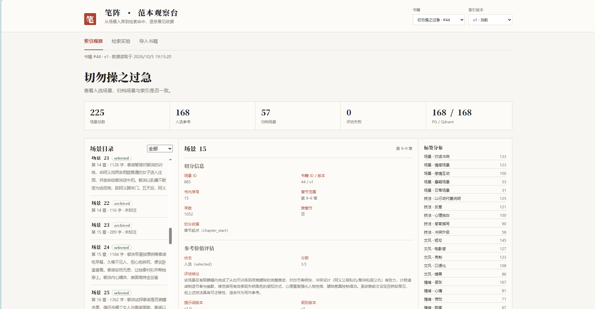
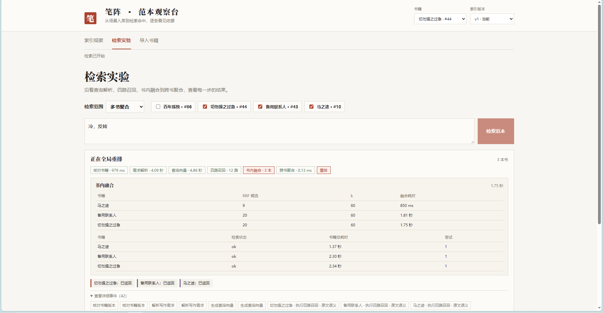
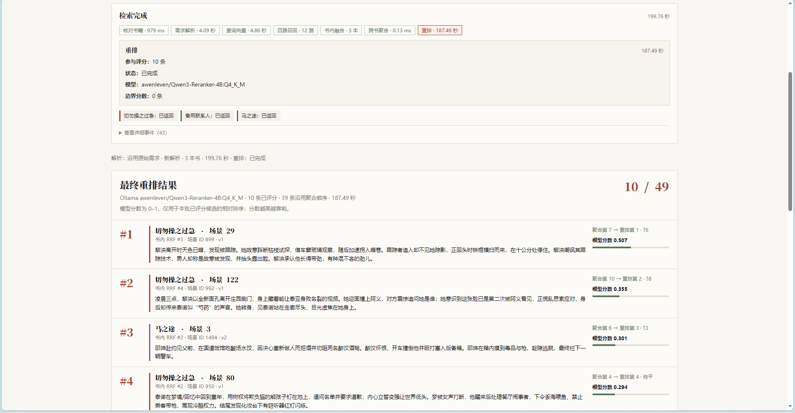
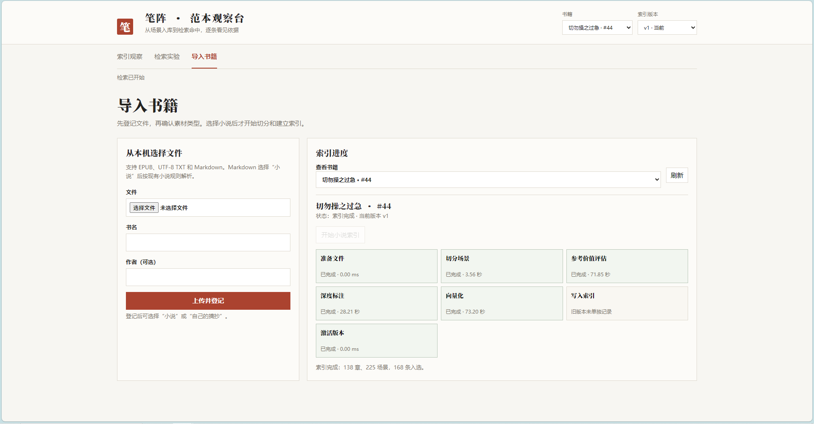
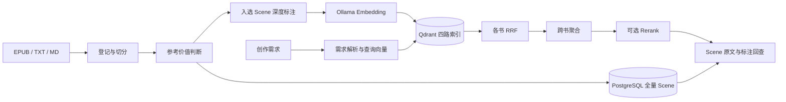

# Novel-RAG

> **让小说从文本，变成可被机器理解、检索和复用的写作经验。**

**Novel-RAG** 是小说创作项目 **novel-creator** 的基础能力之一，也可以独立部署为小说理解与写作范本检索服务。

## 愿景

我们希望解决的核心问题是：**如何让 AI 真正读懂一本小说中值得学习的部分。**

长篇小说中的段落承担着不同功能：剧情过渡、信息承接、日常对白和关键冲突场景的写作参考价值并不相同。有效的场景通常还包含可以迁移的节奏控制、人物互动、情绪推进、信息隐藏、叙事结构与语言风格。

**Novel-RAG** 将作品转化为可检索的写作经验：

```text
小说 → 章节 → Scene → 写作参考价值判断 → 深度理解与结构化标注
     → 语义索引 → 按创作需求检索
```

系统保留完整的 Scene 资产，并筛选值得参考的场景。当创作系统提出“需要人物关系紧张、对白带有试探感、逐步暴露信息的场景”时，它应能找到**适合这个任务的 Scene，并说明参考价值**。

项目的目标是在原始小说与 AI 创作系统之间建立 **Writing Reference Layer（写作范本层）**。它不直接生成小说正文；除了 `novel-creator`，其他 Agent、研究工具或个人知识库也能通过 HTTP API 使用它。长期方向是一套通用的 **Novel Understanding & Writing Reference Engine**：让机器理解 **这一段为什么有效，以及什么时候值得这样写。**

## 当前能力

| 环节 | 已实现内容 |
| --- | --- |
| 导入 | Dashboard 上传 EPUB、UTF-8 TXT、UTF-8 MD；登记后选择“小说”启动索引。个人摘抄入口尚未实现。 |
| 拆解 | EPUB 转文本，章节与 Scene 切分；保留全部原文 Scene。 |
| 判断与标注 | 先评估写作参考价值，再对入选 Scene 做深度结构化标注。 |
| 索引 | PostgreSQL 保存全部场景与标注；Qdrant 为入选场景保存三路稠密向量及一路稀疏向量。 |
| 检索 | 自然语言需求解析、四路召回、书内无权重 RRF、多书并发聚合、可选 Ollama 重排。 |
| 观察 | Dashboard 展示导入与检索阶段、耗时、错误、解析 JSON、候选排序和完整 Scene 回查。 |

`archived` Scene 仍保存在 PostgreSQL，表示它当前未被选为写作范本，不表示解析失败。多书检索只做一次查询解析与向量化，再并发检索各书；全局重排失败时保留聚合结果。个人素材库、写作质量标注与上下文组装仍在规划中。

## 界面预览

### 场景与标注观察

查看 Scene 的切分信息、参考价值评估、标注和全书标签分布。



### 多书检索实验

查看需求解析、四路召回、书内融合、跨书聚合与重排的阶段详情和耗时。



### 重排结果

展示重排前后的名次变化、模型分数与场景来源。



### 书籍导入与索引进度

上传书籍后查看切分、评估、标注、向量化和索引激活的执行状态。



## 技术栈与整体框架

- Python 3.11、FastAPI、Pydantic Settings、SQLAlchemy Core、psycopg
- PostgreSQL：书籍、章节、全量 Scene、标注、索引任务及查询缓存
- Qdrant：入选 Scene 的 `text-dense`、`meta-dense`、`summary-dense`、`text-sparse` 索引
- Ollama：`bge-m3` Embedding；可选 Qwen3 Reranker
- LLM：OpenAI 兼容 API 或 `codex_exec` 适配器，用于参考价值判断、深度标注和需求解析
- 单页 Dashboard：导入、阶段观察、检索实验及结果详情



## 部署条件

- Docker Compose；若本机运行，需 Python 3.11 与 [`uv`](https://docs.astral.sh/uv/)。
- PostgreSQL、Qdrant、Ollama。Compose 会启动这三个服务并持久化数据。
- 可调用的 LLM：在 `.env` 配置 `LLM_BASE_URL`、`LLM_API_KEY`、`LLM_MODEL`，或配置 `codex_exec` 适配器。
- 首次启动会下载 Embedding 模型；开启重排时还会下载 Reranker。模型下载和推理需要足够的磁盘、内存与算力，CPU 可运行但会较慢。
- 当前 API 没有用户认证。Compose 默认只将服务端口绑定到 `127.0.0.1`；对公网开放前须自行加访问控制。

### Docker Compose 启动

```bash
cp .env.example .env
# 编辑 .env：至少设置 POSTGRES_PASSWORD 和 LLM 相关配置
docker compose up -d --build
```

打开 `http://127.0.0.1:8000/dashboard`；交互式 API 文档在 `http://127.0.0.1:8000/docs`。Compose 中应用连接容器内 PostgreSQL、Qdrant、Ollama，宿主机的 `.env` 不需要改成容器服务名。默认仅下载 `bge-m3`；将 `.env` 中 `RERANK_ENABLED=true` 后，执行 `docker compose run --rm ollama-init` 拉取 Reranker。重排开关在每次多书检索前从 `.env` 读取；其他配置更改后应重启 `app`。

Compose 使用持久化卷保存 PostgreSQL、Qdrant 和 Ollama 模型；上传书籍与转换文本在 `data/books/`、`data/converted/`。这些运行数据被 Git 忽略。首次迁移由 `migrate` 服务完成，重复运行迁移脚本不会清空数据。

### 本机开发

```bash
uv sync
cp .env.example .env
# 配置 .env，并准备 PostgreSQL、Qdrant、Ollama
uv run python -m app.db.migrate migrations/001_init.sql
uv run python -m app.db.migrate migrations/002_tag_vocab_aliases.sql
uv run python -m app.db.migrate migrations/003_reference_evaluation.sql
uv run python -m app.db.migrate migrations/004_query_parsing_cache.sql
uv run uvicorn app.main:app --host 127.0.0.1 --port 8000
```

`POSTGRES_DB` 指向需要初始化的数据库。Windows PowerShell 中将 `cp` 换成 `Copy-Item` 即可。真实密钥只放在本机 `.env`，不要提交。

## 三本书测试库

`sql/fixtures/three-books/` 是可恢复的最小多书检索样本，只包含三本已获公开授权作品的当前可用版本：

| 书名 | book_id | version | Scene | Qdrant 入选点 |
| --- | ---: | ---: | ---: | ---: |
| 马之途 | 10 | 2 | 10 | 9 |
| 备用联系人 | 43 | 1 | 99 | 64 |
| 切勿操之过急 | 44 | 1 | 225 | 168 |

`postgres.sql` 包含书籍登记、章节全文、Scene 原文与标注、标签词表和稀疏词映射；`qdrant/*.jsonl` 包含对应向量和场景元数据。`manifest.json` 记录版本、行数、点数及 SHA-256。**原始 EPUB/TXT 未包含在快照中**；恢复后可以检索、浏览，若要重新索引请通过 Dashboard 重新上传原文件。

快照不包含 API 密钥、查询历史、模型输入缓存、Embedding 缓存或索引任务日志。本机 `source_path` 已替换为占位路径。不要把个人数据库直接 `pg_dump` 后提交到公开仓库。

在全新 Compose 数据卷中启动并完成迁移后导入：

```bash
docker compose exec app python -m scripts.restore_public_postgres sql/fixtures/three-books
docker compose exec app python -m scripts.restore_public_qdrant sql/fixtures/three-books
```

导入脚本要求目标 Qdrant 中不存在同名 Collection；SQL 也应仅导入到空的项目库。成功后访问 Dashboard，或提交多书检索：

```json
{"query":"寻找人物关系紧张、对话带有试探意味的场景","book_ids":[10,43,44],"per_book_limit":20,"global_limit":50}
```

源快照可由已授权的数据库重新生成：

```bash
uv run python -m scripts.export_public_fixture --book-ids 10 43 44 --database novel-rag-test-2 --output sql/fixtures/new-export --confirm-public-rights
```

### 作品与侵权联系

测试库中的三本作品及其衍生标注仅用于展示小说理解与检索功能，不因代码仓库公开而授予第三方复制、改编或再分发作品的权利。**若权利人认为相关内容侵权，请通过本仓库 Issues 联系维护者；收到通知后会立即处理、删除相关公开测试数据，并处理仓库历史中的相应内容。**

项目代码采用 [MIT 许可证](LICENSE)，作品原文及测试库内容不适用该许可证。仓库主页：[a-big-fish/Novel-RAG](https://github.com/a-big-fish/Novel-RAG)。

## API 文档

运行后访问 `/docs` 查看 OpenAPI 交互文档，`/openapi.json` 获取机器可读规范。健康检查为 `GET /health`，业务接口统一以 `/api/v1` 开头。

| 用途 | 主要接口 |
| --- | --- |
| 书籍登记与索引 | `POST /books/upload`、`GET /books`、`POST /books/{book_id}/index`、`GET /books/{book_id}/jobs` |
| 版本与场景 | `GET /books/{book_id}/versions`、`GET /books/{book_id}/versions/{version}/scenes`、`GET /scenes/{scene_id}` |
| 单书检索 | `POST /books/{book_id}/search`、`POST /books/{book_id}/search/stream` |
| 多书检索 | `POST /search/multi`、`POST /search/multi/stream` |
| 组件调试 | `POST /qdrant/collections/{collection}/points/search`、`GET /qdrant/collections/{collection}/points/{point_id}` |

两个 `/stream` 接口返回 NDJSON：`progress` 表示阶段进度，`result.data` 是最终结果，`error.message` 表示失败。完整的 Scene 原文通过数据库详情接口回查；RRF 候选仅携带 `scene_id` 与限长预览。

全局重排由 `.env` 中的 `RERANK_ENABLED` 控制。启用后使用 `OLLAMA_RERANK_MODEL` 对跨书候选评分；失败时 `rerank.status` 和诊断日志会给出原因，最终候选退回聚合顺序。重排可能明显增加检索时间。

## 测试

```bash
uv run pytest tests/unit -q
uv run pytest tests/integration -q -m integration
```

单元测试不依赖外部服务；集成测试需要 PostgreSQL、Qdrant 和测试隔离环境。模型测试仅发送 Scene 或有界样本，不会把整本书作为单次模型输入。测试库快照的数据恢复还会检查 SQL 行数与 Qdrant Point 数量。

## 目录结构

```text
app/                    FastAPI、LLM/Ollama 客户端、索引与检索服务
app/prompts/            判断、深度标注、需求解析提示词
dashboard/              导入、索引进度和检索实验界面
images/                 README 展示用的界面截图
migrations/             PostgreSQL 迁移历史
sql/fixtures/three-books/
                        PostgreSQL 数据 SQL、Qdrant JSONL、校验清单
scripts/                测试库导出、Qdrant 恢复、本地预览脚本
tests/                  单元、集成、手工真实链路测试
data/                   本地上传与转换缓存，不进入 Git
compose.yaml            PostgreSQL、Qdrant、Ollama 与应用编排
Dockerfile              应用镜像
```
